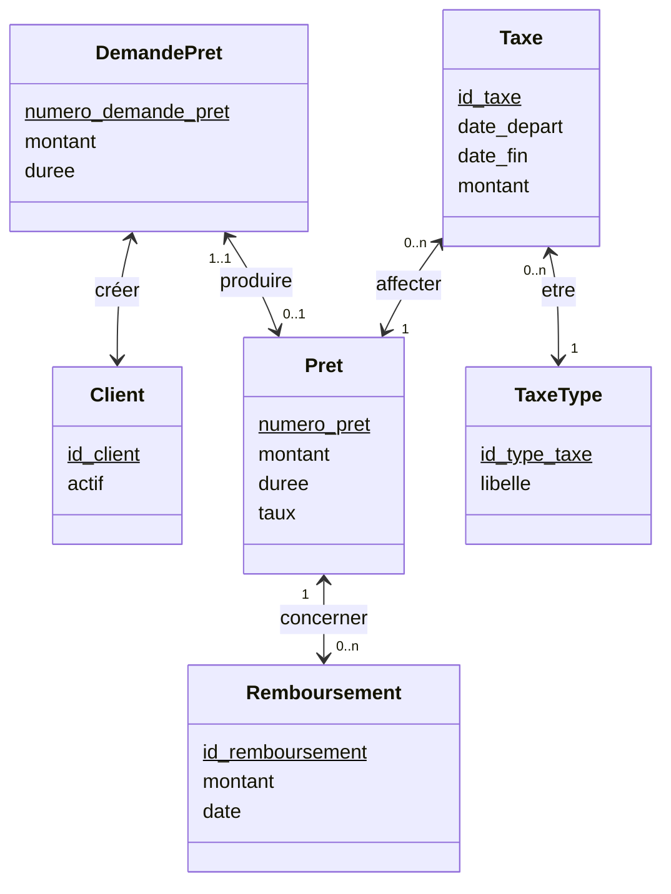

```mermaid
classDiagram
    class DemandePret {
        numero_demande_pret$
        montant
        duree
    }
    class Client {
        id_client$
        actif
    }
    class Pret {
        numero_pret$
        montant
        duree
        taux
    }
    class Remboursement {
        id_remboursement$
        montant
        date
    }
    class Taxe {
        id_taxe$
        date_depart
        date_fin
        montant
    }
    class TaxeType {
        id_type_taxe$
        libelle
    }
    DemandePret  <--> Client : créer
    Pret "1" <--> "0..n" Remboursement : concerner
    DemandePret "1..1" <--> "0..1" Pret : produire
    Taxe "0..n" <--> "1" Pret : affecter
    Taxe "0..n" <--> "1" TaxeType : etre
```
